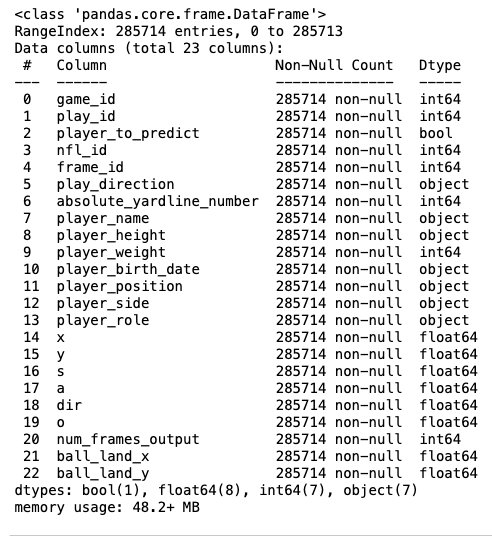
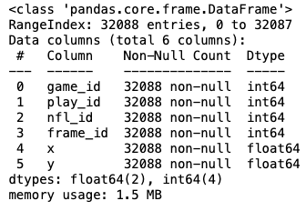
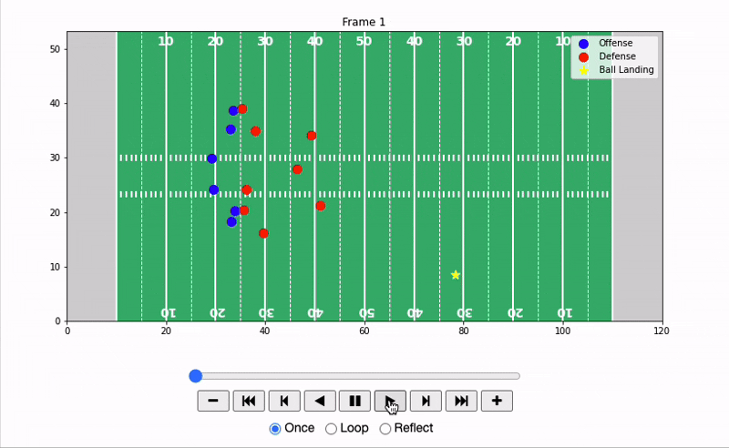
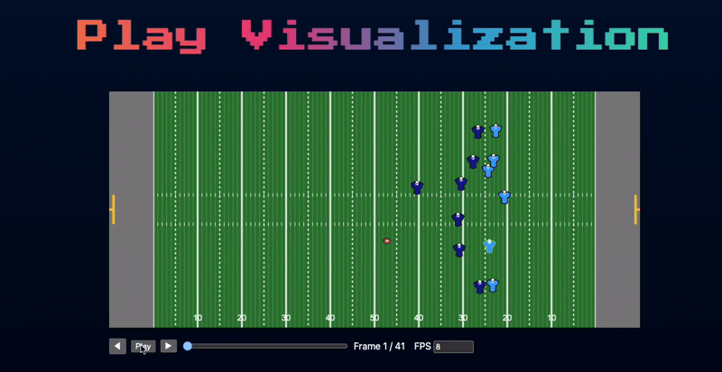

# Post Throw Player Trajectory Prediction

## Framing the Problem

### Core Problem Statement
In a given passing play in football, can we determine the movement of select individuals after a throw has been made, given pre throw context?

### Why It's Important
In football, every single advantage matters. From understanding how offensive linemen are positioned to being able to read a blitz, the movement and positioning of players can almost always reveal crucial factors that can win or lose games. In this project, I aim to develop a model that improves our undestanding of how players move after the ball is thrown.

While modern tracking data allows us to observe how players moved on a given play, it does not tell us how they would move under slightly different conditions. A predictive model transforms tracking data from something purely descriptive into something actionable. Instead of simply replaying a pass play, we will be able to simulate the play under different conditions, enabling:

1. Counterfactual Analysis: evaluating scenarios that did not occur such as how players would move if the ball was thrown to a different area 

2. Coverage Discipline: quantifying react speed and spatial recovery 

3. Scheme Evaluation: analyzing how an offensive or defensive alignment contributes to how players move

4. Strategic Simulation: evaluating route concepts or coverages

### Modeling Perspective
Accurately modeling post-throw movement ideally requires architectures capable of learning spatial interactions and temporal dependencies, such as graph neural networks or recurrent models. Since these approaches are beyond the scope of my current coursework, I instead focus on a classical machine learning framework that approximates sequential behavior through autoregression.

The core idea is to predict player movement one frame at a time. Rather than directly predicting absolute field coordinates, I model delta x and delta y, representing the change in position between consecutive frames. Because player displacement over a short time interval is bounded and relatively small, these delta values exhibit significantly lower variance than raw coordinates, leading to a more stable and generalizable regression problem.


The model operates autoregressively:

- Predict delta x and delta y for the next frame.

- Update the player’s coordinates using the predicted deltas.

- Recompute derived features from the predicted position.

- Feed those features back into the model for the next prediction step.

- This iterative process allows multi-frame forecasting using a single-step regression model.

## Exploratory Data Analysis

### Input
The input we are given consists of passing plays from all games in the 2023 regular season from week 1 to week 18. Each week is split up into different input CSV files and has unique ids to identify the game, play, and player. Each play contains a sequence of frames that is updated every tenth of a second, e.g. frame 10 will be 1 second into the play. The input dataframe info for week 1 is shown below:




### Output
The output dataframe contains information regarding the players coordinates after the throw has been made until the ball is either caught or incomplete. The ouput dataframe for week 1 is shown below:



### Full Play Animation
To visualize what a play it its full sequence, I have combined the output and input data. This visualization serves two purposes:

1. Confirming Frame Alignment
2. Visualizing how different players move throughout the play

The animation below shows a play from the Dolphins vs Chargers game from week 1 of the 2023 NFL Season. This play occurred in the 4th quarter at 3:47. 



### Understanding our Data
The input data gives us a number of features that are helpful in understanding our goal. The first set of features are the identification features

- ```game_id```
- ```play_id```
- ```nfl_id``` - id of the player
- ```frame_id```


The second set of features are play related static features that are the same for all players with the same play_id:

- ```num_frames_output```, number of output frames needed to be predicted
- ```ball_land_x``` and ```ball_land_y```, the coordinates of where the ball lands


The third set of features are categorical features :
- ```player_position```
-  ```player_role``` - what does the player do during the play, similar to player position but more general
- ```player_to_predict```  - boolean value which tells us if that players position needs to be predicted


The fourth set of features are the numerical features. These include:

- ```x``` and ```y```, the coordinates of where the player is located
- ```s``` and ```a```, speed and acceleration
- ```d``` and ```o```, direction angle and orientation angle

### Feature Engineering and Data Preparation (EDA Rationale)
Before modeling, I performed several preprocessing and exploratory steps to better understand the structure of the data and reduce unnecessary variance that could hinder generalization.

#### Input and Output Alignment
Input and output frames were merged on game, play, and player identifiers to ensure temporal continuity at the player level. During exploratory analysis, it became clear that pre-throw and post-throw movement exhibit fundamentally different dynamics: pre-throw behavior reflects alignment and route development, while post-throw behavior reflects reaction and pursuit. To allow the model to distinguish these phases explicitly, I introduced a time-relative-to-throw feature. This ensures the model is not implicitly forced to infer phase shifts solely from positional data.

#### Field Regularization
Initial visualization of plays revealed substantial variance caused by field orientation and ball position rather than true movement differences. The same route concept could appear mirrored depending on play direction. To reduce this structural noise, all plays were normalized to face right and x-coordinates were re-centered relative to the line of scrimmage. This transformation reduces artificial variance and allows the model to focus on movement patterns rather than field geometry artifacts.

#### Feature Constraints Based on Available Information
Because the output dataset only contained x and y coordinates, I intentionally restricted feature engineering to variables that could be derived solely from positional data. While additional attributes such as direction, orientation, or play context might improve predictive performance, they would not be available at inference time when recursively predicting future frames.

#### Target Reformulation (Δx, Δy)

When looking at the raw x and y coordinates, their values varied a lot depending on where the play started and what was happening in the game. A player lining up at midfield versus near the goal line could have very different coordinate ranges, even if their movement pattern was similar.

However, when examining how much a player moved between consecutive frames, the changes in position (Δx and Δy) were much smaller and more consistent across plays. Because of this, I chose to predict the change in position rather than the absolute location on the field.

By modeling movement instead of raw position, the problem becomes more stable and easier for the model to learn. It also shifts the focus from “where is the player on the field?” to “how is the player moving?”, which better matches the goal of predicting post-throw dynamics.

## Model Results and Inference

The model uses an autoregressive regression framework to predict player displacement (Δx, Δy) one frame at a time. Single-step predictions are stable due to low variance in displacement, while multi-step rollouts remain qualitatively realistic despite some error accumulation. Predicted trajectories preserve key behaviors such as pursuit angles, route continuation, and clustering near the catch point.

### Inference Pipeline
1. Initialize from final pre-throw frame  
2. Predict Δx, Δy  
3. Update player positions  
4. Recompute features  
5. Repeat for all future frames  

This allows full trajectory simulation without access to future ground truth. :contentReference[oaicite:0]{index=0}


### Time Series Autoregressive Approach
The model treats player movement as a time series, learning a transition from current state → next state. By predicting incremental movement instead of absolute position, the model reduces variance and enables stable, iterative forecasting across multiple frames.

### Business Applications (NFL)
- Simulate defensive reactions to different throw locations  
- Evaluate coverage discipline and pursuit efficiency  
- Analyze and optimize offensive/defensive schemes  
- Support player development through scenario simulation  

This shifts tracking data from descriptive analysis to predictive decision-making.

---

## Next Steps

- **RNNs / LSTMs:** Capture longer temporal dependencies and reduce error accumulation  
- **Transformers:** Model global temporal patterns and player importance via attention  
- **Multi-Agent Modeling:** Incorporate player-to-player interactions (e.g., graph-based approaches)  
- **Richer Features:** Add play context, player tendencies, and game situation  
- **Uncertainty Modeling:** Predict distributions over trajectories instead of single paths  
- **Improved Metrics:** Evaluate using football-specific outcomes (e.g., coverage tightness)  
- **Deployment:** Build real-time simulation tools for coaching and game planning  
